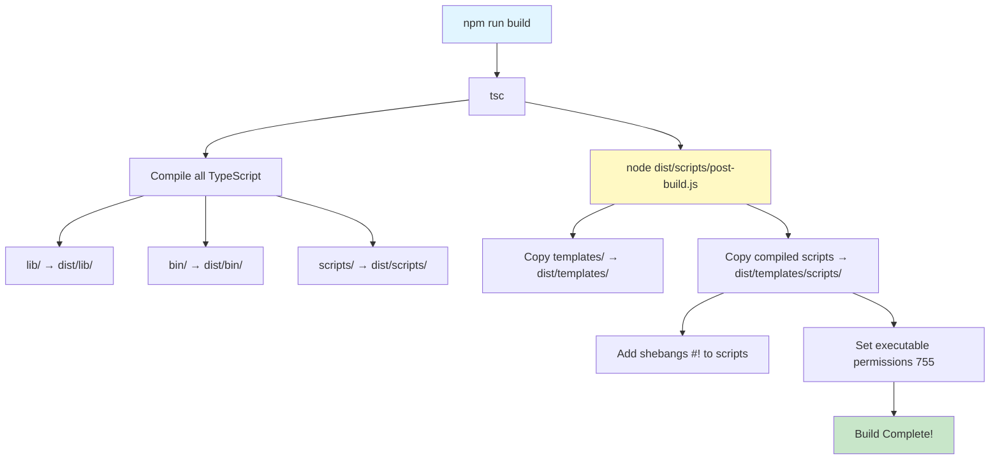
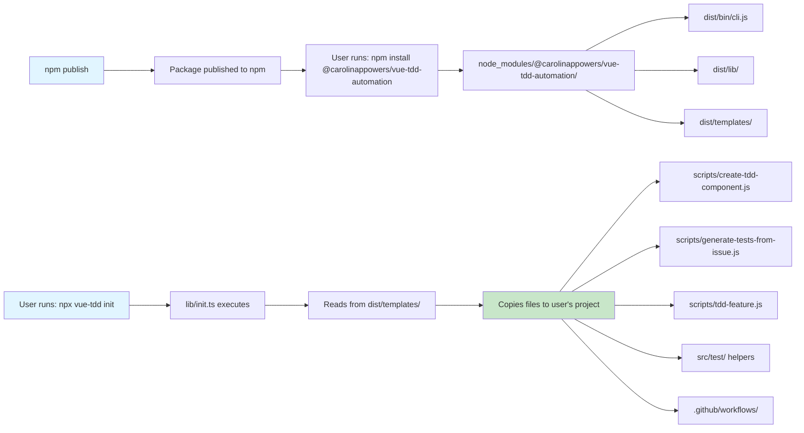
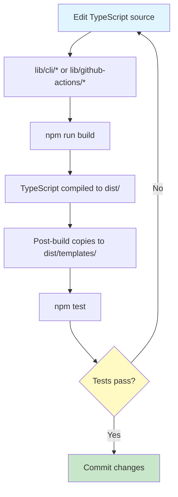
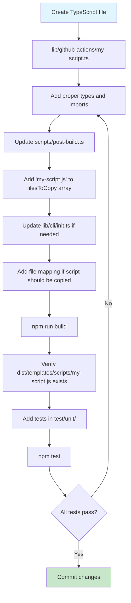

# Architecture Documentation

This document explains the project architecture, build process, and how the TypeScript source code is compiled and distributed to users.

## Table of Contents

- [Overview](#overview)
- [Directory Structure](#directory-structure)
- [Build Process](#build-process)
- [Distribution Flow](#distribution-flow)
- [Development Workflow](#development-workflow)
- [Adding New Scripts](#adding-new-scripts)

## Overview

This package uses a **TypeScript-first development approach** with a **compiled distribution strategy**:

- **Development**: All source code is written in TypeScript
- **Distribution**: Users receive compiled JavaScript files
- **Templates**: Source templates are copied and compiled scripts are added during build

### Key Principles

1. ✅ **No JavaScript in source** - All development files are TypeScript
2. ✅ **Compiled distribution** - Users get optimized JavaScript
3. ✅ **Clear separation** - Source vs. build artifacts are obvious
4. ✅ **Single source of truth** - Templates and scripts compiled from one location

## Directory Structure

```
vue-tdd-automation/
├── lib/                          # TypeScript source code
│   ├── cli/                      # Self-contained CLI commands
│   │   ├── init.ts              # 'vue-tdd init' command
│   │   ├── create.ts            # 'vue-tdd create' command
│   │   └── feature.ts           # 'vue-tdd feature' command
│   ├── github-actions/          # Scripts for GitHub Actions workflows
│   │   ├── create-tdd-component.ts
│   │   ├── generate-tests-from-issue.ts
│   │   └── tdd-feature.ts
│   └── shared/                  # Shared between CLI and GitHub Actions
│       ├── test-generator/      # Shared test generation logic
│       │   ├── index.ts
│       │   ├── types.ts
│       │   └── validator.ts
│       └── json-utils.ts
├── bin/                          # CLI entry points
│   └── cli.ts
├── scripts/                      # Build and development scripts
│   ├── post-build.ts            # Copies templates and scripts
│   └── dev/                     # Development tools (not distributed)
│       └── create-test-project.sh
├── templates/                    # Source templates (not compiled)
│   ├── docs/                    # Documentation templates
│   ├── github/                  # GitHub workflow templates
│   ├── test/                    # Test helper templates
│   └── vitest.config.ts
├── dist/                         # Build output (gitignored)
│   ├── bin/                     # Compiled CLI
│   ├── lib/                     # Compiled library code
│   │   ├── cli/                # Compiled CLI commands
│   │   ├── github-actions/     # Compiled GitHub Actions scripts
│   │   └── shared/             # Compiled shared code
│   └── templates/               # Ready-to-distribute templates
│       ├── docs/
│       ├── github/
│       ├── scripts/            # Compiled scripts with shebangs
│       │   ├── create-tdd-component.js
│       │   ├── generate-tests-from-issue.js
│       │   └── tdd-feature.js
│       ├── test/
│       └── vitest.config.ts
└── test/                         # Unit and integration tests
```

## Build Process

### Build Flow



### Step-by-Step Build Process

1. **TypeScript Compilation** (`tsc`)
   ```bash
   lib/github-actions/create-tdd-component.ts → dist/lib/github-actions/create-tdd-component.js
   lib/github-actions/generate-tests-from-issue.ts → dist/lib/github-actions/generate-tests-from-issue.js
   lib/github-actions/tdd-feature.ts → dist/lib/github-actions/tdd-feature.js
   ```

2. **Post-Build Script** (`dist/scripts/post-build.js`)
   - Copies entire `templates/` directory → `dist/templates/`
   - Copies compiled scripts from `dist/lib/github-actions/` → `dist/templates/scripts/`
   - Adds shebang (`#!/usr/bin/env node`) to each script
   - Sets executable permissions (`chmod 755`)

3. **Result**
   - `dist/templates/scripts/` contains all user-facing scripts
   - Each script is executable with proper shebang
   - Ready for npm distribution

## Distribution Flow

### How Users Receive Files



### package.json Files Array

Only the `dist/` directory is published to npm:

```json
{
  "files": [
    "dist/bin/**/*.js",
    "dist/bin/**/*.d.ts",
    "dist/lib/**/*.js",
    "dist/lib/**/*.d.ts",
    "dist/templates",
    "README.md",
    "LICENSE"
  ]
}
```

**Note**: The source `templates/` directory is **not** published. Only `dist/templates/` is distributed.

## Development Workflow

### Making Changes to Scripts



### Development Commands

```bash
# Build the project
npm run build

# Run tests
npm test
npm run test:watch
npm run test:coverage

# Linting
npm run lint
npm run lint:fix

# Test locally before publishing
npm run build
npm pack
# Install in test project: npm install ../vue-tdd-automation/vue-tdd-automation-0.1.0.tgz
```

### Git Pre-commit Hooks

This project uses Husky and lint-staged:

1. **ESLint** - Automatically fixes linting issues on staged files
2. **Vitest** - Runs tests related to changed files

To bypass hooks (only if necessary):
```bash
git commit --no-verify
```

## Adding New Scripts

### When to Add a New Script

Add a new script when you need:
- A user-facing CLI tool that runs in the user's project
- A script that will be copied to `scripts/` directory
- Automated functionality triggered by GitHub Actions

### Steps to Add a New Script



#### Example: Adding a new script

1. **Create the TypeScript source:**

   ```typescript
   // lib/github-actions/my-new-script.ts
   #!/usr/bin/env node

   import fs from 'fs';
   import path from 'path';

   console.log('Hello from my new script!');
   ```

2. **Add to post-build copy list:**

   ```typescript
   // scripts/post-build.ts
   const filesToCopy = [
     'create-tdd-component.js',
     'generate-tests-from-issue.js',
     'tdd-feature.js',
     'my-new-script.js'  // Add this
   ];
   ```

3. **Optionally add to init command:**

   ```typescript
   // lib/cli/init.ts
   if (scripts) {
     filesToCopy.push(
       { src: 'scripts/tdd-feature.js', dest: 'scripts/tdd-feature.js' },
       { src: 'scripts/create-tdd-component.js', dest: 'scripts/create-tdd-component.js' },
       { src: 'scripts/my-new-script.js', dest: 'scripts/my-new-script.js' }  // Add this
     );
   }
   ```

4. **Build and test:**

   ```bash
   npm run build
   npm test
   npm run lint
   ```

5. **Verify output:**

   ```bash
   ls -lh dist/templates/scripts/my-new-script.js
   # Should show executable permissions and proper size

   head -n 1 dist/templates/scripts/my-new-script.js
   # Should output: #!/usr/bin/env node
   ```

### Script Import Best Practices

When writing scripts that will be copied to user projects:

❌ **Don't** use relative imports to package internals:
```typescript
// This breaks when copied to user's project
import { something } from '../../dist/lib/something.js';
```

✅ **Do** import from shared library modules:
```typescript
// In lib/github-actions/, import from shared code
import { generateTestContent } from '../shared/test-generator/index.js';
```

✅ **Do** use standard Node.js modules:
```typescript
import fs from 'fs';
import path from 'path';
import { execSync } from 'child_process';
```

## Testing the Build

### Local Package Testing

Before publishing, test the package with a real Vue project:

```bash
# 1. Build and pack the package
npm run build
npm pack

# 2. In a test Vue project
npm install /path/to/vue-tdd-automation-0.1.0.tgz

# 3. Test the CLI
npx vue-tdd init
npx vue-tdd create MyComponent
npm run tdd:feature

# 4. Verify all scripts work
npm run tdd
npm run create:component
```

See [TESTING_QUICK_START.md](./TESTING_QUICK_START.md) for detailed testing instructions.

## Troubleshooting

### Common Issues

**Issue**: Scripts are not executable after copying to user project
```bash
# Solution: Post-build script adds shebang and sets permissions
# Check: dist/templates/scripts/*.js should all have #!/usr/bin/env node
head -n 1 dist/templates/scripts/*.js
```

**Issue**: TypeScript compilation errors
```bash
# Solution: Check tsconfig.json includes the file
# Verify: lib/ and scripts/ are in "include" array
cat tsconfig.json | grep include
```

**Issue**: Scripts not found in dist/templates/scripts/
```bash
# Solution: Check post-build.ts filesToCopy array
# Verify the script name is listed
cat scripts/post-build.ts | grep filesToCopy -A 5
```

**Issue**: Import errors when script runs in user project
```bash
# Solution: Don't import from package internals
# Use relative imports to sibling modules in lib/
# Example: import { X } from '../test-generator/index.js'
```

## Architecture Decisions

### Why TypeScript Source + JavaScript Distribution?

1. **Type Safety**: Catch errors at compile time during development
2. **Better DX**: IDE autocomplete, refactoring, type checking
3. **User Compatibility**: Users don't need TypeScript to run scripts
4. **Flexibility**: Users can modify copied .js files if needed

### Why Copy Templates to dist/?

1. **Single distribution artifact**: Everything in `dist/` is ready to publish
2. **No source leakage**: Only compiled/processed files are distributed
3. **Clear separation**: Source (`templates/`) vs. build output (`dist/templates/`)
4. **Build verification**: Can test the exact files users will receive

### Why Shebang in Post-Build?

TypeScript strips shebangs during compilation, so we add them back in the post-build step to ensure scripts are executable.

## Related Documentation

- [CLI.md](./CLI.md) - Complete CLI command reference
- [TESTING_QUICK_START.md](./TESTING_QUICK_START.md) - Quick testing guide
- [TEST_SETUP.md](./TEST_SETUP.md) - Comprehensive testing guide
- [CONTRIBUTING.md](./CONTRIBUTING.md) - Contribution guidelines
- [README.md](./README.md) - Package overview and quick start

## Questions or Issues?

If you have questions about the architecture or need help understanding how something works:

1. Check this document and related documentation
2. Look at the code in `scripts/post-build.ts` to see the build process
3. Open an issue on GitHub with your question

---

**Last Updated**: 2025-10-12
