# CLI Usage Guide with Visual Flows

This document provides visual flowcharts and detailed explanations for using the `vue-tdd` CLI tool.

## Table of Contents

1. [CLI Overview](#cli-overview)
2. [Command: vue-tdd init](#command-vue-tdd-init)
3. [Command: vue-tdd create](#command-vue-tdd-create)
4. [Command: vue-tdd feature](#command-vue-tdd-feature)
5. [GitHub Actions Integration](#github-actions-integration)
6. [Common Workflows](#common-workflows)

---

## CLI Overview

The `vue-tdd` CLI provides three main commands:

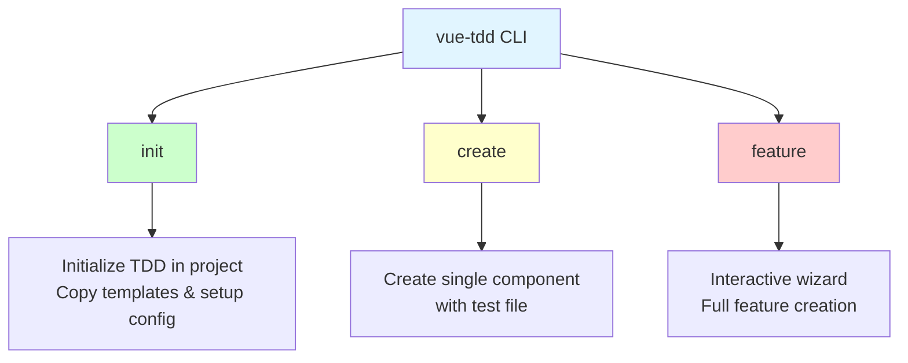

### Command Summary

| Command | Purpose | When to Use |
|---------|---------|-------------|
| `init` | Setup TDD infrastructure | Once per project, at the start |
| `create` | Create a single component | Quick component creation |
| `feature` | Interactive feature wizard | Complex features with full requirements |

---

## Command: vue-tdd init

### Purpose

Initializes the TDD workflow in your Vue.js project by installing test helpers, configurations, scripts, and workflows.

### Syntax

```bash
npx vue-tdd init [options]
```

### Options

```
--no-workflows     Skip GitHub Actions workflows
--no-docs          Skip documentation files
--no-scripts       Skip component creation scripts
--copilot          Add GitHub Copilot instructions file
--force            Overwrite existing files
```

### Flow Diagram

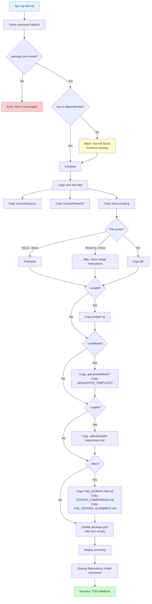

### What Gets Installed

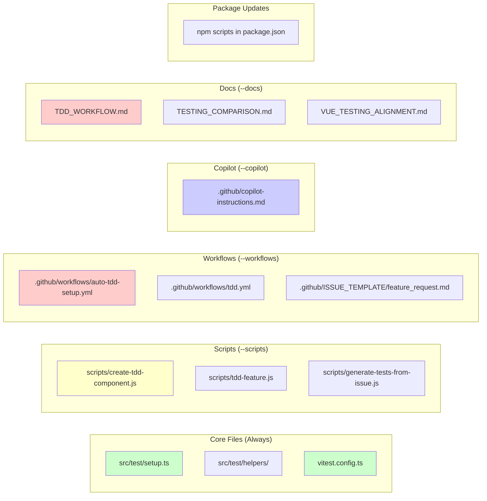

### Example Usage

```bash
# Full installation (recommended for new projects)
npx vue-tdd init

# With GitHub Copilot support
npx vue-tdd init --copilot

# Minimal setup (core files only)
npx vue-tdd init --no-workflows --no-docs --no-scripts

# Core files + scripts only
npx vue-tdd init --no-workflows --no-docs

# Overwrite existing files
npx vue-tdd init --force
```

### Output Example

```
🤖 Initializing Vue TDD Workflow...

📦 Installing TDD infrastructure...

✅ Copied: src/test/setup.ts
✅ Copied: src/test/helpers/index.ts
✅ Copied: src/test/helpers/testing-library.ts
✅ Copied: src/test/helpers/vue-testing.ts
✅ Copied: src/test/helpers/composables-testing.ts
✅ Copied: vitest.config.ts
✅ Copied: scripts/tdd-feature.js
✅ Copied: scripts/create-tdd-component.js
✅ Copied: .github/workflows/auto-tdd-setup.yml
✅ Copied: TDD_WORKFLOW.md

📊 Summary: 10 files copied, 0 skipped

✅ Added script: test
✅ Added script: tdd

✅ TDD workflow initialized successfully!

Next steps:
  1. Run npm install to install dependencies
  2. Create your first component: npx vue-tdd create MyComponent
  3. Read TDD_WORKFLOW.md for detailed guide
```

---

## Command: vue-tdd create

### Purpose

Quickly create a new component with a test file.

### Syntax

```bash
npx vue-tdd create <name> [description] [options]
```

### Arguments

- `name` (required) - Component name in PascalCase (e.g., `UserCard`)
- `description` (optional) - Component description

### Options

```
--ai-generate      Use AI to generate test implementations (requires API key)
--copilot-ready    Generate Copilot-optimized scaffolds with rich context
```

### Flow Diagram

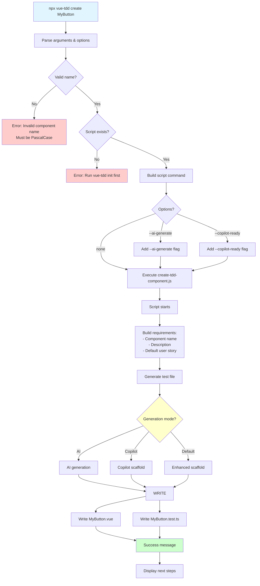

### File Generation Detail

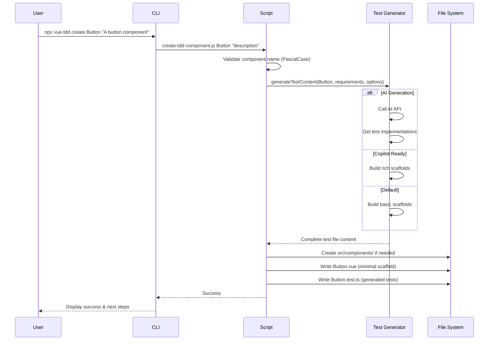

### Example Usage

```bash
# Basic component creation
npx vue-tdd create UserCard "Displays user profile information"

# With AI generation
npx vue-tdd create LoginForm "User login form" --ai-generate

# With Copilot-optimized scaffolds
npx vue-tdd create SearchBar "Search input component" --copilot-ready

# Minimal (name only)
npx vue-tdd create Button
```

### Generated Files

For `npx vue-tdd create UserCard`:

**src/components/UserCard.vue:**
```vue
<template>
  <div class="user-card">
    <!-- Implement component following TDD -->
  </div>
</template>

<script setup lang="ts">
// Component implementation goes here
</script>

<style scoped>
.user-card {
  /* Add styles */
}
</style>
```

**src/components/UserCard.test.ts:**
```typescript
/**
 * UserCard Component Tests
 * Auto-generated from TDD Feature CLI
 *
 * User Story: Component: UserCard
 *
 * This test file follows TDD approach - all tests should fail initially (Red phase)
 */

import { describe, it, expect, beforeEach, vi, afterEach } from 'vitest'
import { render, screen, waitFor } from '@/test/helpers/testing-library'
import { mount } from '@vue/test-utils'
import UserCard from './UserCard.vue'

describe('UserCard Component', () => {
  beforeEach(() => {
    vi.clearAllMocks();
  });

  afterEach(() => {
    vi.restoreAllMocks();
  });

  describe('Accessibility', () => {
    // Generated accessibility tests...
  });
});
```

---

## Command: vue-tdd feature

### Purpose

Interactive wizard for creating a complete feature with detailed requirements, user story, and comprehensive test scenarios.

### Syntax

```bash
npx vue-tdd feature [options]
```

### Options

```
--no-issue         Skip GitHub issue creation
--ai-generate      Use AI to generate test implementations
--copilot-ready    Generate Copilot-optimized scaffolds
```

### Flow Diagram

```mermaid
graph TD
    START[npx vue-tdd feature] --> LAUNCH[Launch interactive wizard]

    LAUNCH --> Q1[Prompt: Component name?]
    Q1 --> A1[User: UserProfile]

    A1 --> Q2[Prompt: User story?]
    Q2 --> A2[User: As a user, I want...]

    A2 --> Q3[Prompt: Acceptance criteria?]
    Q3 --> A3[User: List criteria]

    A3 --> Q4[Prompt: Props?]
    Q4 --> A4[User: userId: string, ...]

    A4 --> Q5[Prompt: Events?]
    Q5 --> A5[User: profileUpdated, ...]

    A5 --> Q6[Prompt: Happy path scenarios?]
    Q6 --> A6[User: List scenarios]

    A6 --> Q7[Prompt: Edge cases?]
    Q7 --> A7[User: List edge cases]

    A7 --> Q8[Prompt: Error cases?]
    Q8 --> A8[User: List error cases]

    A8 --> ISSUE_CHECK{--issue flag?}

    ISSUE_CHECK -->|--issue| Q9[Prompt: Create GitHub issue?]
    ISSUE_CHECK -->|--no-issue| BUILD_REQS

    Q9 --> A9{User confirms?}
    A9 -->|Yes| CREATE_ISSUE[Create GitHub issue]
    A9 -->|No| BUILD_REQS

    CREATE_ISSUE --> ISSUE_API[Call GitHub API]
    ISSUE_API --> ISSUE_SUCCESS[Issue #123 created]
    ISSUE_SUCCESS --> BUILD_REQS

    BUILD_REQS[Build requirements object] --> GEN_TEST[Generate test file]

    GEN_TEST --> MODE{Generation mode?}

    MODE -->|--ai-generate| AI_PATH[AI generation]
    MODE -->|--copilot-ready| COPILOT_PATH[Copilot scaffolds]
    MODE -->|default| SCAFFOLD_PATH[Enhanced scaffolds]

    AI_PATH --> WRITE
    COPILOT_PATH --> WRITE
    SCAFFOLD_PATH --> WRITE

    WRITE[Write files] --> COMP[UserProfile.vue]
    WRITE --> TEST[UserProfile.test.ts]

    COMP --> SUCCESS[Success summary]
    TEST --> SUCCESS

    SUCCESS --> NEXT[Display next steps]

    style START fill:#e1f5ff
    style SUCCESS fill:#ccffcc
    style CREATE_ISSUE fill:#ffffcc
```

### Interactive Prompts Detail

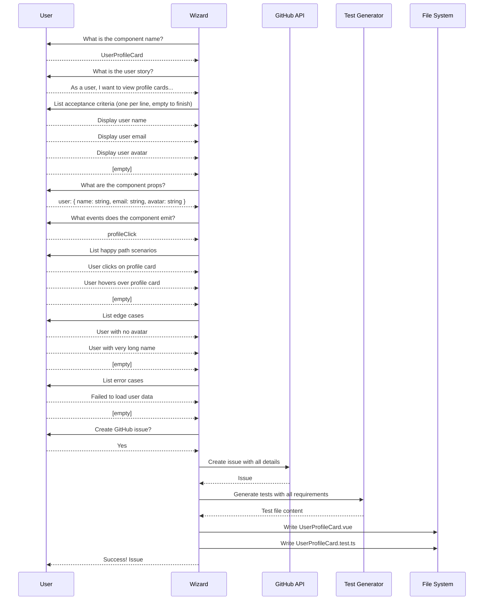

### Example Usage

```bash
# Interactive wizard (default)
npx vue-tdd feature

# Skip GitHub issue creation
npx vue-tdd feature --no-issue

# With AI generation
npx vue-tdd feature --ai-generate

# With Copilot scaffolds
npx vue-tdd feature --copilot-ready

# AI generation without issue
npx vue-tdd feature --no-issue --ai-generate
```

### Example Session

```
🚀 Feature Creation Wizard

? Component name: UserProfileCard
? User story: As a user, I want to view user profile cards so I can see user information at a glance

? Acceptance criteria (press Enter to add more, empty line to finish):
  1: Display user name
  2: Display user email
  3: Display user avatar
  4: [Enter]

? Component props (e.g., "value: string, onChange: Function"):
  user: { name: string, email: string, avatar: string }

? Component events (e.g., "change, submit"):
  profileClick

? Happy path scenarios (press Enter to add more, empty line to finish):
  1: User views profile card with all information
  2: User clicks on profile card
  3: [Enter]

? Edge cases:
  1: User with no avatar displays default
  2: User with very long name is truncated
  3: [Enter]

? Error cases:
  1: Failed to load user data shows error state
  2: [Enter]

? Create GitHub issue for this feature? (Y/n): Y

✨ Creating feature...
✅ GitHub issue #42 created: UserProfileCard
✅ Component created: src/components/UserProfileCard.vue
✅ Tests created: src/components/UserProfileCard.test.ts

Next steps:
  1. Run npm run tdd to start test watch mode
  2. Implement the component to make tests pass
  3. View issue: https://github.com/user/repo/issues/42
```

---

## GitHub Actions Integration

### Workflow: Auto TDD Setup

Automatically creates tests when a GitHub issue with `feature-request` label is created.

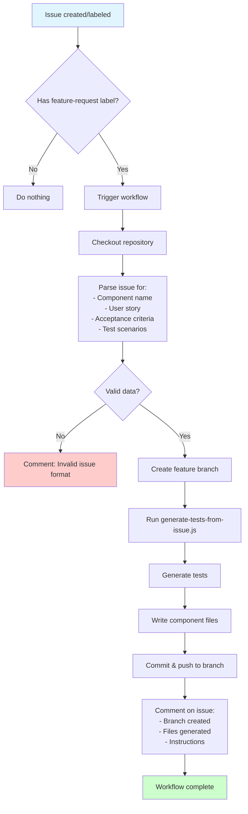

### Issue → Tests Flow

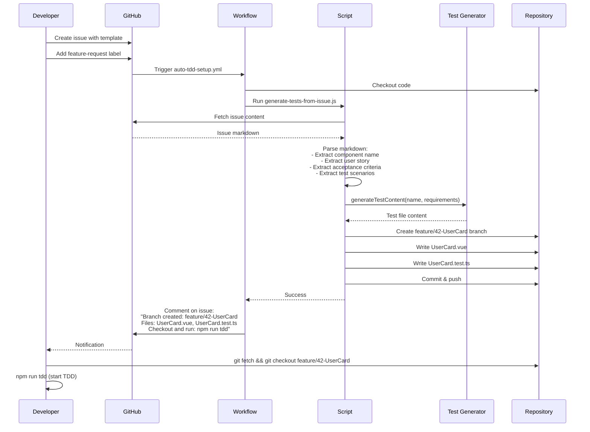

---

## Common Workflows

### Workflow 1: New Project Setup

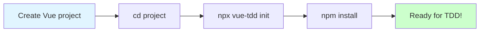

**Commands:**
```bash
npm create vue@latest my-project
cd my-project
npx vue-tdd init --copilot
npm install
npm install -D @testing-library/jest-dom @testing-library/user-event @testing-library/vue @types/node @vitejs/plugin-vue @vue/test-utils @vitest/ui @vitest/coverage-v8 happy-dom vitest
```

### Workflow 2: Quick Component Creation

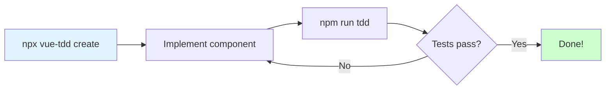

**Commands:**
```bash
npx vue-tdd create Button "A reusable button component"
npm run tdd
# Implement Button.vue until tests pass
```

### Workflow 3: Feature with GitHub Issue

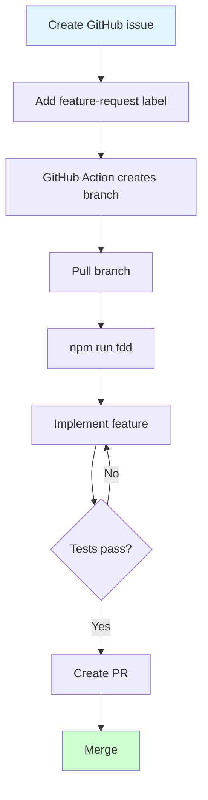

**Commands:**
```bash
# After GitHub Action runs:
git fetch origin
git checkout feature/42-UserCard
npm run tdd
# Implement until tests pass
git push
gh pr create
```

### Workflow 4: Full Feature with CLI

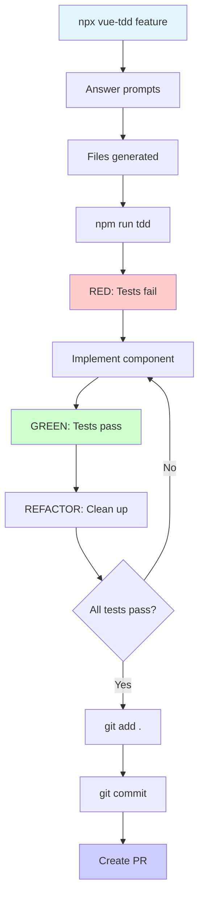

**Commands:**
```bash
npx vue-tdd feature --ai-generate
# Answer all prompts
npm run tdd
# RED phase: See failing tests
# GREEN phase: Implement until tests pass
# REFACTOR phase: Clean up code while tests stay green
git add .
git commit -m "feat: add UserProfile component"
gh pr create
```

---

## Summary

The `vue-tdd` CLI provides three levels of component creation:

1. **init** - One-time project setup
2. **create** - Quick component creation for simple needs
3. **feature** - Full-featured wizard for complex components

Each command supports multiple generation modes (AI, Copilot, Default) and integrates seamlessly with GitHub workflows for team collaboration.

Choose the right command based on your needs:
- Use `init` once at project start
- Use `create` for quick, simple components
- Use `feature` for complex features with detailed requirements
- Use GitHub issues for team-wide, automated TDD workflows
