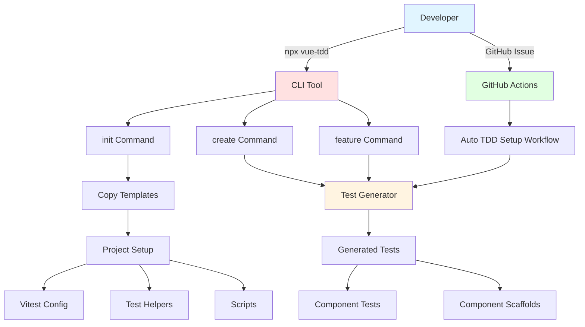
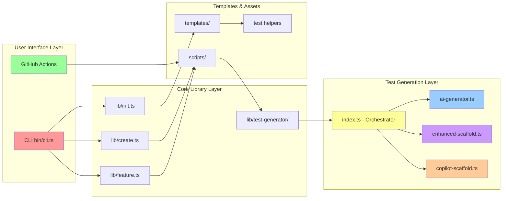
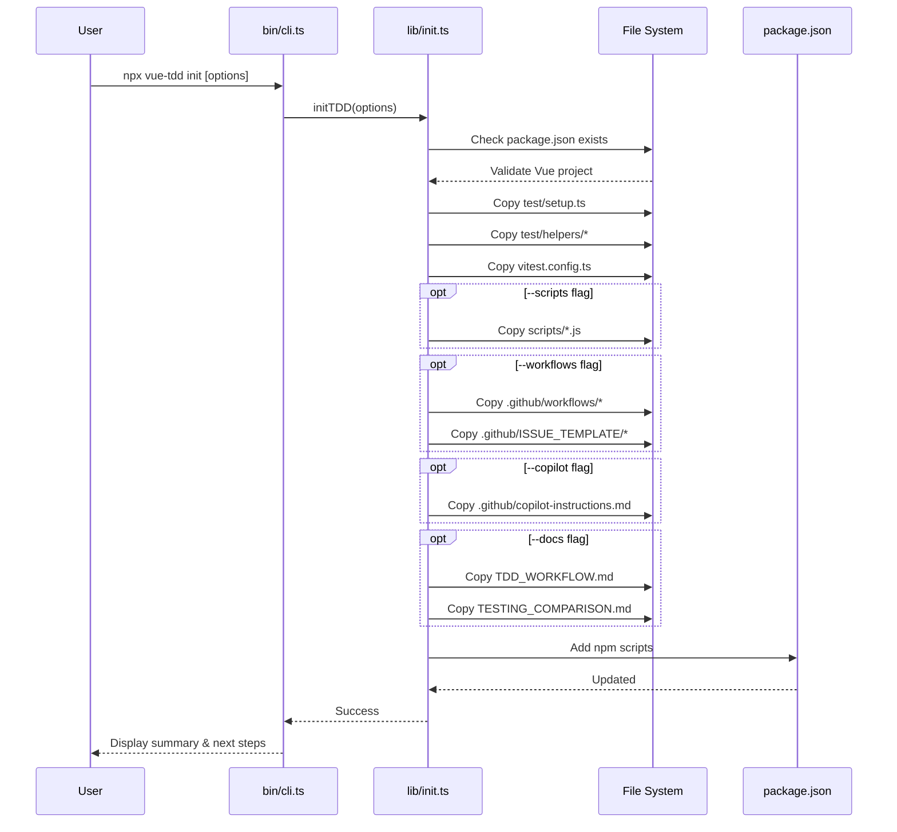
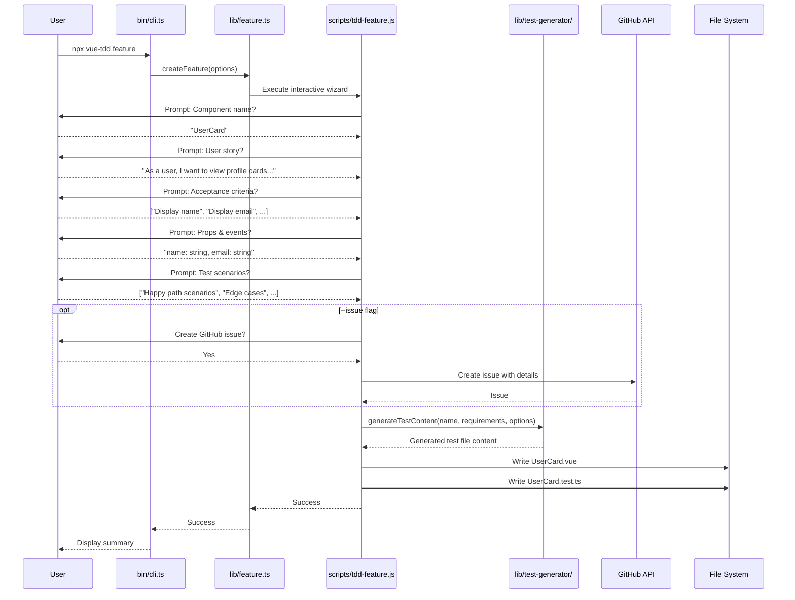
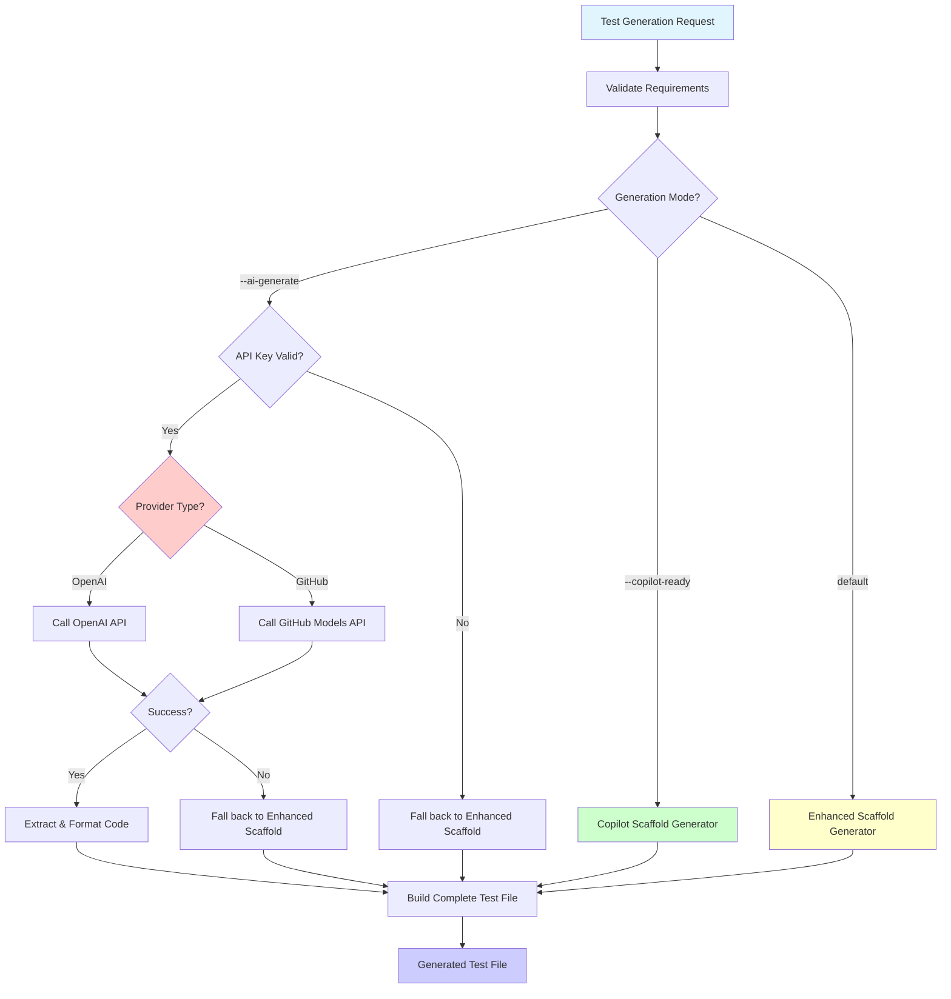
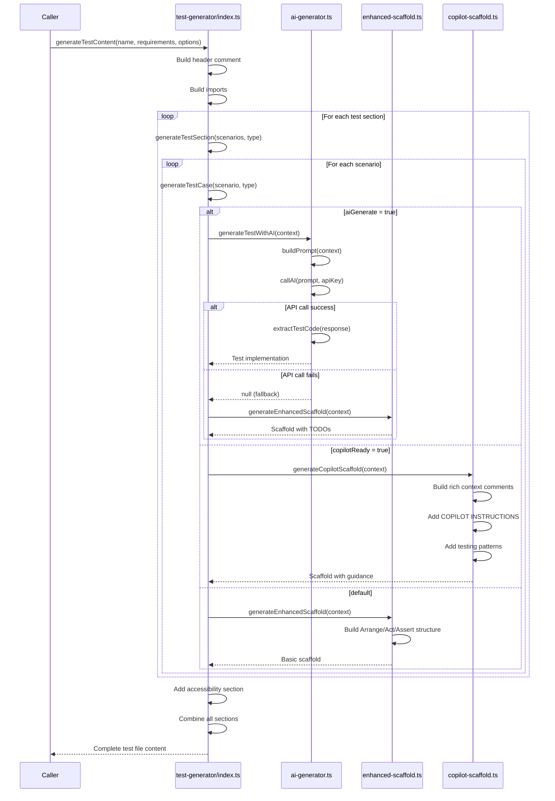
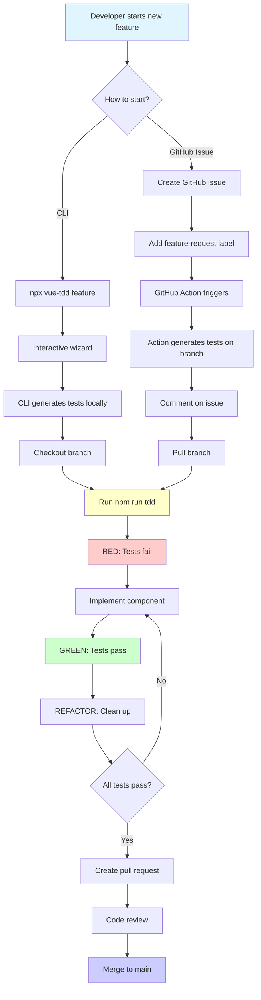
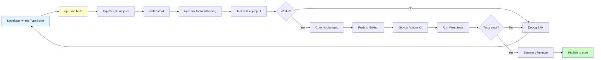

# Vue TDD Automation - Package Architecture

This document provides a comprehensive overview of how the `@vue-tdd/automation` package works, with visual diagrams and detailed explanations.

## Table of Contents

1. [Package Overview](#package-overview)
2. [High-Level Architecture](#high-level-architecture)
3. [CLI Command Flow](#cli-command-flow)
4. [Test Generation System](#test-generation-system)
5. [File Structure](#file-structure)
6. [Key Components](#key-components)

---

## Package Overview

`@vue-tdd/automation` is an NPM package that automates Test-Driven Development (TDD) workflows for Vue.js applications. It provides:

- **CLI Tool** (`vue-tdd`) - Command-line interface for developers
- **Test Generator** - Automated test file creation from requirements
- **GitHub Integration** - Workflow automation via GitHub Actions
- **AI-Powered Options** - Optional AI test generation with OpenAI/GitHub Models
- **Templates** - Pre-built test helpers, configurations, and scaffolds



---

## High-Level Architecture

The package follows a modular architecture with clear separation of concerns:



### Architecture Layers

1. **User Interface Layer**
   - CLI commands (`init`, `create`, `feature`)
   - GitHub Actions workflows

2. **Core Library Layer**
   - Command implementations
   - Orchestration logic
   - Template management

3. **Test Generation Layer**
   - Test content generation
   - AI integration
   - Scaffold generation

4. **Templates & Assets**
   - Reusable templates
   - Test helpers
   - Configuration files

---

## CLI Command Flow

### Command: `vue-tdd init`

Initializes TDD infrastructure in a Vue project.



### Command: `vue-tdd create <name>`

Creates a component with test file.

```mermaid
sequenceDiagram
    participant U as User
    participant CLI as bin/cli.ts
    participant CREATE as lib/create.ts
    participant SCRIPT as scripts/create-tdd-component.js
    participant TG as lib/test-generator/
    participant FS as File System

    U->>CLI: npx vue-tdd create MyButton "description" [--ai-generate]
    CLI->>CREATE: createComponent(name, desc, options)

    CREATE->>SCRIPT: Execute script with args
    SCRIPT->>TG: generateTestContent(name, requirements)

    alt AI Generation Enabled
        TG->>TG: validateAIConfig()
        TG->>TG: generateTestWithAI()
        TG-->>SCRIPT: AI-generated test code
    else Copilot-Ready Mode
        TG->>TG: generateCopilotScaffold()
        TG-->>SCRIPT: Rich scaffold with context
    else Default Mode
        TG->>TG: generateEnhancedScaffold()
        TG-->>SCRIPT: Standard scaffold
    end

    SCRIPT->>FS: Write src/components/MyButton.vue
    SCRIPT->>FS: Write src/components/MyButton.test.ts

    SCRIPT-->>CREATE: Success
    CREATE-->>CLI: Success
    CLI-->>U: Display next steps
```

### Command: `vue-tdd feature`

Interactive feature creation wizard.



---

## Test Generation System

The test generation system is the core of the package. It supports three modes:



### Test Generation Flow Details



### AI Generation Details

```mermaid
graph TB
    subgraph "AI Generator Flow"
        START[generateTestWithAI] --> CHECK_KEY{API Key?}

        CHECK_KEY -->|No key| NULL1[Return null]
        CHECK_KEY -->|Has key| BUILD_PROMPT[buildPrompt]

        BUILD_PROMPT --> ADD_CONTEXT["Add Context:<br/>- Component name<br/>- Test type<br/>- Scenario<br/>- User story<br/>- Props/Events<br/>- Acceptance criteria"]

        ADD_CONTEXT --> ADD_REQS["Add Requirements:<br/>- Testing Library queries<br/>- user-event interactions<br/>- Async/await handling<br/>- Arrange/Act/Assert<br/>- TypeScript types"]

        ADD_REQS --> DETECT{API Key Type?}

        DETECT -->|ghp_* / ghs_*| GH_API[GitHub Models API]
        DETECT -->|sk-*| OAI_API[OpenAI API]
        DETECT -->|other| NULL2[Return null]

        GH_API --> GH_CALL[POST to models.inference.ai.azure.com]
        OAI_API --> OAI_CALL[POST to api.openai.com]

        GH_CALL --> RESPONSE{Response OK?}
        OAI_CALL --> RESPONSE

        RESPONSE -->|Error| ERROR["Log error,<br/>Return null"]
        RESPONSE -->|Success| EXTRACT[extractTestCode]

        EXTRACT --> CLEAN[Clean markdown blocks]
        CLEAN --> CHECK_WRAPPER{"Has it() wrapper?"}

        CHECK_WRAPPER -->|Yes| UNWRAP[Extract body only]
        CHECK_WRAPPER -->|No| TRIM[Trim whitespace]

        UNWRAP --> RETURN[Return test code]
        TRIM --> RETURN
    end

    style START fill:#e1f5ff
    style GH_API fill:#ccffcc
    style OAI_API fill:#ffcccc
    style RETURN fill:#ccccff
    style ERROR fill:#ff9999
```



---

## File Structure

```
vue-tdd-automation/
├── bin/
│   └── cli.ts                      # CLI entry point (vue-tdd command)
│
├── lib/
│   ├── init.ts                     # Initialize TDD in project
│   ├── create.ts                   # Create component with tests
│   ├── feature.ts                  # Interactive feature wizard
│   ├── json-utils.ts               # JSON parsing utilities
│   │
│   └── test-generator/
│       ├── index.ts                # Main test generator orchestrator
│       ├── types.ts                # TypeScript interfaces
│       ├── ai-generator.ts         # AI-powered test generation
│       ├── enhanced-scaffold.ts    # Scaffold with TODOs
│       ├── copilot-scaffold.ts     # Copilot-optimized scaffolds
│       └── validator.ts            # Requirement validation
│
├── templates/
│   ├── test/
│   │   ├── setup.ts                # Vitest setup
│   │   └── helpers/
│   │       ├── index.ts            # Helper exports
│   │       ├── testing-library.ts  # Testing Library helpers
│   │       ├── vue-testing.ts      # Vue Test Utils helpers
│   │       └── composables-testing.ts
│   │
│   ├── scripts/
│   │   ├── tdd-feature.js          # Interactive wizard script
│   │   ├── create-tdd-component.js # Component creation script
│   │   └── generate-tests-from-issue.js
│   │
│   ├── github/
│   │   ├── workflows/
│   │   │   ├── auto-tdd-setup.yml  # Issue → Branch → Tests
│   │   │   └── tdd.yml             # Test runner workflow
│   │   ├── ISSUE_TEMPLATE/
│   │   │   └── feature_request.md
│   │   └── copilot-instructions.md
│   │
│   ├── docs/
│   │   ├── TDD_WORKFLOW.md
│   │   ├── TESTING_COMPARISON.md
│   │   └── VUE_TESTING_ALIGNMENT.md
│   │
│   └── vitest.config.ts            # Vitest configuration
│
├── dist/                           # Compiled JavaScript output
│   ├── bin/
│   ├── lib/
│   └── templates/
│
└── package.json                    # Package metadata
```

---

## Key Components

### 1. CLI Entry Point (`bin/cli.ts`)

The main entry point for the `vue-tdd` command. Uses Commander.js for CLI parsing.

**Commands:**
- `vue-tdd init [options]` - Initialize TDD workflow
- `vue-tdd create <name> [description] [options]` - Create component
- `vue-tdd feature [options]` - Interactive wizard

**Options:**
- `--ai-generate` - Use AI for test generation
- `--copilot-ready` - Generate Copilot-optimized scaffolds
- `--no-workflows`, `--no-docs`, `--no-scripts` - Skip parts of init
- `--copilot` - Add Copilot instructions
- `--force` - Overwrite existing files

### 2. Init Module (`lib/init.ts`)

Copies template files to the user's project and sets up the TDD infrastructure.

**Process:**
1. Validates Vue project (checks for `package.json` with Vue)
2. Copies core test files (always)
3. Copies optional files based on flags
4. Updates `package.json` with test scripts
5. Displays installation instructions

**Key Files Copied:**
- `src/test/setup.ts` - Vitest setup with Testing Library
- `src/test/helpers/*` - Test helper functions
- `vitest.config.ts` - Vitest configuration with coverage
- `scripts/*` - Component creation scripts
- `.github/workflows/*` - GitHub Actions
- Documentation files

### 3. Test Generator (`lib/test-generator/index.ts`)

The orchestrator for test file generation. Coordinates between AI, Copilot, and scaffold generators.

**Key Functions:**

#### `generateTestContent()`
Main entry point - generates complete test file content.

**Inputs:**
- `componentName` - PascalCase component name
- `requirements` - Test requirements object
- `options` - Generation options (AI, Copilot flags)

**Output:**
Complete test file as a string with:
- Header comment (component info, user story)
- Imports (Vitest, Testing Library, component)
- Test suites (describe blocks)
- Test cases (it blocks)

**Process:**
1. Validate requirements
2. Build header comment
3. Build imports
4. Generate test sections:
   - Acceptance Criteria
   - Happy Path
   - Edge Cases
   - Error Handling
   - Accessibility (always included)
5. Combine all sections
6. Return complete file

#### `generateTestSection()`
Generates a test section (describe block) with multiple test cases.

#### `generateTestCase()`
Generates a single test case (it block). Routes to appropriate generator based on options.

### 4. AI Generator (`lib/test-generator/ai-generator.ts`)

Handles AI-powered test generation using OpenAI or GitHub Models API.

**Key Functions:**

#### `generateTestWithAI(context)`
Generates actual test implementation using AI.

**Process:**
1. Check for API key (OPENAI_API_KEY or GITHUB_TOKEN)
2. Build detailed prompt with context
3. Detect provider (OpenAI vs GitHub Models)
4. Call appropriate API
5. Extract and clean test code
6. Return implementation or null (on failure)

#### `validateAIConfig()`
Validates API configuration and returns provider info.

**Supported Providers:**
- **OpenAI** - Keys starting with `sk-`
- **GitHub Models** - Tokens starting with `ghp_` or `ghs_`

### 5. Enhanced Scaffold Generator (`lib/test-generator/enhanced-scaffold.ts`)

Generates structured test scaffolds with Arrange/Act/Assert pattern and TODO comments.

**Key Functions:**

#### `generateEnhancedScaffold(context)`
Creates a test scaffold based on test type.

**Scaffold Types:**
- **Standard** (happy, edge, acceptance) - Basic Arrange/Act/Assert with examples
- **Error** - Error handling specific structure
- **Accessibility** - Keyboard, screen reader, or generic a11y tests

**Features:**
- Clear Arrange/Act/Assert comments
- TODO comments with actionable examples
- Failing assertion (`expect(true).toBe(false)`) for TDD Red phase
- Props and events context in comments

### 6. Copilot Scaffold Generator (`lib/test-generator/copilot-scaffold.ts`)

Generates scaffolds optimized for GitHub Copilot completion with rich context.

**Features:**
- Detailed COPILOT INSTRUCTIONS comments
- User story and acceptance criteria in comments
- Component props and events documented
- Step-by-step guidance
- Testing Library best practices inline
- Common patterns and examples
- Links to documentation

**Purpose:**
Maximizes Copilot's ability to suggest accurate completions by providing extensive context.

### 7. Scripts (`templates/scripts/`)

JavaScript scripts that run in the user's project (not as part of the CLI).

#### `create-tdd-component.js`
- Creates component file (minimal Vue scaffold)
- Generates test file using test generator
- Supports AI and Copilot modes

#### `tdd-feature.js`
- Interactive CLI wizard (uses inquirer)
- Collects feature requirements from user
- Optionally creates GitHub issue
- Generates component and tests

#### `generate-tests-from-issue.js`
- Used by GitHub Actions
- Parses GitHub issue for requirements
- Extracts user story, acceptance criteria, scenarios
- Generates tests from issue content

### 8. GitHub Actions Workflows

#### `auto-tdd-setup.yml`
Triggered when `feature-request` label is added to issue.

**Process:**
1. Checkout repository
2. Parse issue for component name
3. Create feature branch
4. Run `generate-tests-from-issue.js`
5. Commit and push tests
6. Comment on issue with instructions

#### `tdd.yml`
Runs tests on pull requests.

**Process:**
1. Checkout code
2. Install dependencies
3. Run tests with coverage
4. Report results

---

## Development Workflow

### User Perspective



### Package Development Workflow



---

## Summary

The `@vue-tdd/automation` package provides a complete TDD automation solution for Vue.js projects through:

1. **CLI Tool** - Easy-to-use commands for initialization and component creation
2. **Test Generator** - Intelligent test generation with multiple modes (AI, Copilot, Scaffold)
3. **Templates** - Battle-tested test helpers and configurations
4. **GitHub Integration** - Automated workflows for issue-driven development
5. **Flexibility** - Works with or without AI, adapts to team preferences

The architecture is modular, allowing each component to be used independently while working together seamlessly for an integrated TDD experience.
