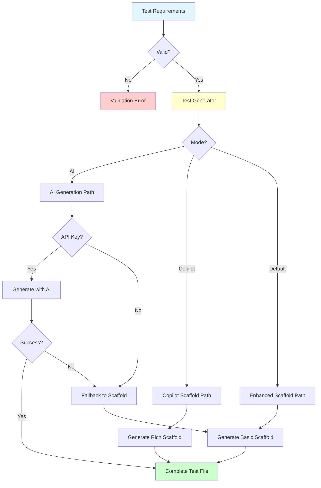
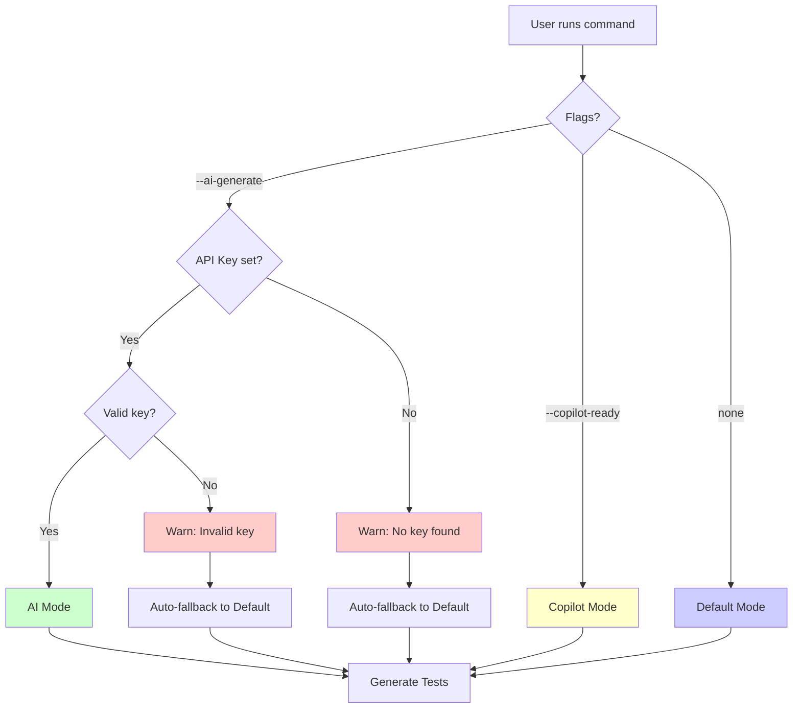
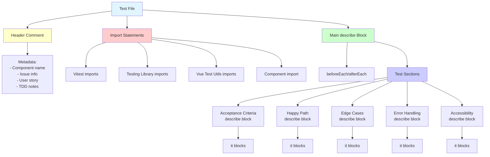
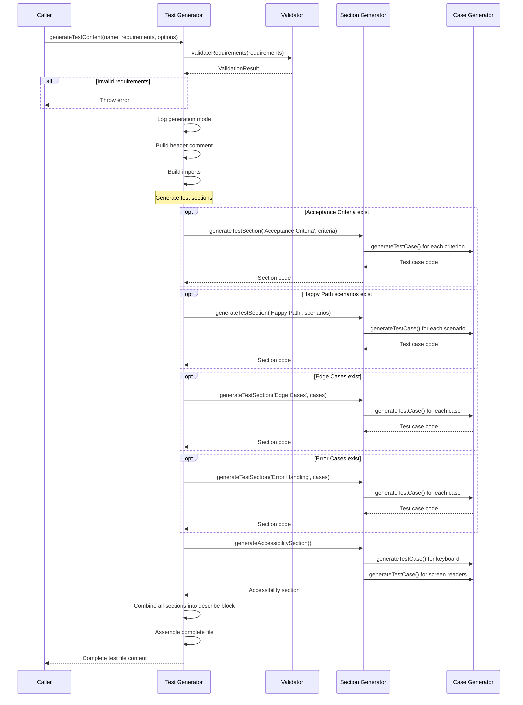
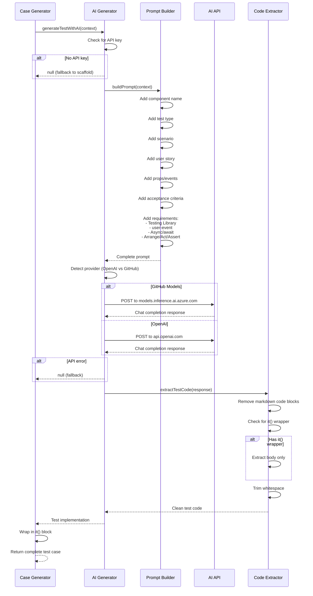
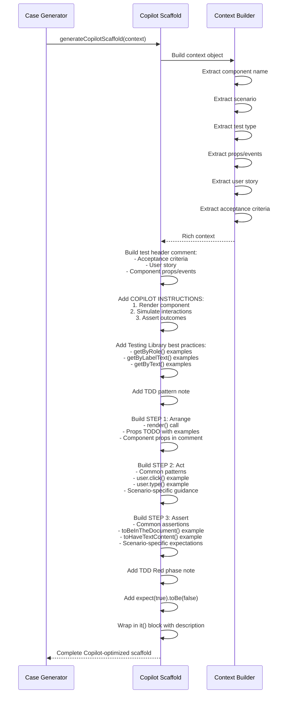
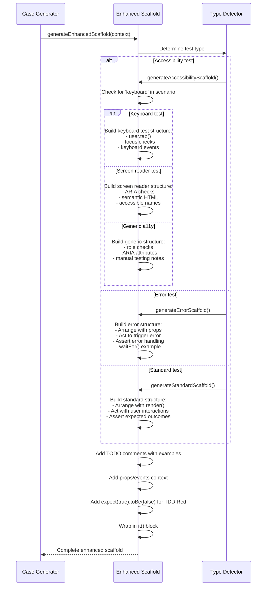
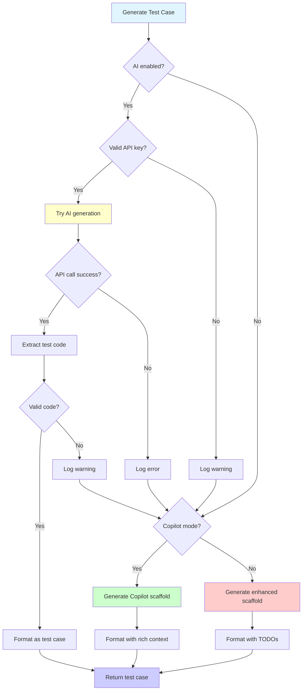
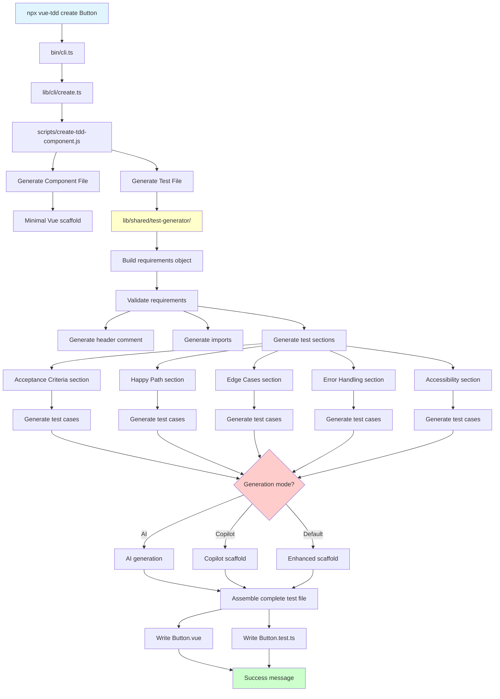

# Test Generation System - Detailed Flow

This document provides an in-depth look at how the test generation system works in `@carolinappowers/vue-tdd-automation`.

## Table of Contents

1. [Overview](#overview)
2. [Generation Modes](#generation-modes)
3. [Test Content Structure](#test-content-structure)
4. [Detailed Flows](#detailed-flows)
5. [Examples](#examples)

---

## Overview

The test generation system is the heart of the package. It takes feature requirements (user stories, acceptance criteria, test scenarios) and generates complete test files in three different modes:

1. **AI Generation** - Uses OpenAI or GitHub Models API to generate actual test implementations
2. **Copilot-Ready** - Generates scaffolds optimized for GitHub Copilot completion
3. **Enhanced Scaffold** - Generates structured scaffolds with Arrange/Act/Assert pattern



---

## Generation Modes

### Mode Comparison

| Feature | AI Generation | Copilot-Ready | Enhanced Scaffold |
|---------|--------------|---------------|-------------------|
| **Requires** | API Key | GitHub Copilot | Nothing |
| **Output** | Working tests | Rich scaffolds | Basic scaffolds |
| **Speed** | Slower (API calls) | Fast | Fast |
| **Cost** | API usage fees | Free | Free |
| **Accuracy** | High (AI-powered) | Medium (developer completes) | Low (developer writes) |
| **Customization** | Limited | High | High |
| **Learning Curve** | Low | Medium | High |
| **Best For** | Fast development | Teams with Copilot | Learning TDD |

### Mode Selection Flow



---

## Test Content Structure

Every generated test file follows this structure:



### Test File Template

```typescript
/**
 * ComponentName Component Tests
 * GitHub Issue #123: Feature Title
 *
 * User Story: As a user, I want...
 *
 * This test file follows TDD approach - all tests should fail initially (Red phase)
 */

import { describe, it, expect, beforeEach, vi, afterEach } from 'vitest'
import { render, screen, waitFor } from '@/test/helpers/testing-library'
import { mount } from '@vue/test-utils'
import ComponentName from './ComponentName.vue'

describe('ComponentName Component', () => {
  beforeEach(() => {
    vi.clearAllMocks();
  });

  afterEach(() => {
    vi.restoreAllMocks();
  });

  describe('Acceptance Criteria', () => {
    // Generated test cases...
  });

  describe('Happy Path', () => {
    // Generated test cases...
  });

  describe('Edge Cases', () => {
    // Generated test cases...
  });

  describe('Error Handling', () => {
    // Generated test cases...
  });

  describe('Accessibility', () => {
    // Always included - keyboard & screen reader tests
  });
});
```

---

## Detailed Flows

### 1. Main Generation Flow



### 2. AI Generation Flow



### 3. Copilot Scaffold Generation Flow



### 4. Enhanced Scaffold Generation Flow



---

## Examples

### Example 1: AI-Generated Test

**Input:**
```javascript
{
  componentName: 'UserCard',
  scenario: 'Display user name and email',
  type: 'acceptance',
  props: 'name: string, email: string',
  userStory: 'As a user, I want to view user profile cards'
}
```

**Output:**
```typescript
it('should display user name and email', async () => {
  // Acceptance Criteria: Display user name and email

  // Arrange
  const { user } = render(UserCard, {
    props: {
      name: 'John Doe',
      email: 'john@example.com'
    }
  });

  // Act
  // Component renders immediately, no interaction needed

  // Assert
  expect(screen.getByRole('heading', { level: 2 })).toHaveTextContent('John Doe');
  expect(screen.getByText('john@example.com')).toBeInTheDocument();
});
```

### Example 2: Copilot-Ready Scaffold

**Input:**
```javascript
{
  componentName: 'LoginForm',
  scenario: 'User submits valid credentials',
  type: 'happy',
  props: 'onSubmit: (email: string, password: string) => void',
  userStory: 'As a user, I want to log in to access my account'
}
```

**Output:**
```typescript
it('should user submits valid credentials', async () => {
  // Happy Path: User submits valid credentials
  // User Story: As a user, I want to log in to access my account
  // Component props: onSubmit: (email: string, password: string) => void
  //
  // COPILOT INSTRUCTIONS:
  // 1. Render the LoginForm component with appropriate props
  // 2. Simulate user interactions that match the scenario: "User submits valid credentials"
  // 3. Assert that the expected outcome is achieved
  //
  // Testing Library Best Practices:
  // - Use getByRole() for semantic queries (preferred)
  // - Use getByLabelText() for form inputs
  // - Use getByText() for text content
  //
  // TDD Pattern: This test should FAIL initially (Red phase)

  // STEP 1: Arrange - Set up the test environment
  const { user } = render(LoginForm, {
    props: {
      // TODO: Add props based on: onSubmit: (email: string, password: string) => void
      // Example: onSubmit: vi.fn()
    }
  });

  // STEP 2: Act - Simulate user interactions
  // Common patterns:
  //   - Click: await user.click(screen.getByRole('button', { name: /text/i }))
  //   - Type: await user.type(screen.getByLabelText('Label'), 'value')
  //
  // For this scenario: User submits valid credentials
  // TODO: Type email and password, click submit button

  // STEP 3: Assert - Verify the expected outcome
  // Common assertions:
  //   - Element visible: expect(screen.getByText('text')).toBeInTheDocument()
  //   - Function called: expect(mockFn).toHaveBeenCalledWith(expected)
  //
  // TODO: Verify onSubmit was called with correct credentials

  // TDD Red Phase: This should fail until component is implemented
  expect(true).toBe(false); // Remove this line after implementing the test
});
```

### Example 3: Enhanced Scaffold

**Input:**
```javascript
{
  componentName: 'Counter',
  scenario: 'Increment button increases count',
  type: 'happy',
  events: 'increment, decrement'
}
```

**Output:**
```typescript
it('should increment button increases count', async () => {
  // Happy Path: Increment button increases count

  // Arrange
  const { user } = render(Counter, {
    props: {
      // TODO: Add required props if needed
    }
  });
  // Available events: increment, decrement

  // Act
  // TODO: Implement user interactions based on scenario:
  // Increment button increases count
  // Examples:
  //   await user.click(screen.getByRole('button', { name: /submit/i }));
  //   await user.type(screen.getByLabelText('Email'), 'test@example.com');
  //   await user.selectOptions(screen.getByLabelText('Country'), 'US');

  // Assert
  // TODO: Add assertions to verify: Increment button increases count
  // Examples:
  //   expect(screen.getByText('Success!')).toBeInTheDocument();
  //   expect(screen.queryByText('Error')).not.toBeInTheDocument();
  //   expect(screen.getByRole('alert')).toHaveTextContent('Saved');

  expect(true).toBe(false); // This should fail (TDD - Red phase)
});
```

---

## Test Generation Decision Tree



---

## Component Creation Complete Flow

This shows the entire flow from command to generated files:



---

## Summary

The test generation system is a sophisticated multi-mode generator that:

1. **Validates** input requirements
2. **Structures** tests into logical sections
3. **Generates** test cases in three modes:
   - AI-powered implementations
   - Copilot-optimized scaffolds
   - Enhanced scaffolds with TODOs
4. **Handles** fallbacks gracefully when AI is unavailable
5. **Produces** complete, well-structured test files ready for TDD

This flexible system allows teams to choose the right mode for their workflow while maintaining consistent test structure and quality.
